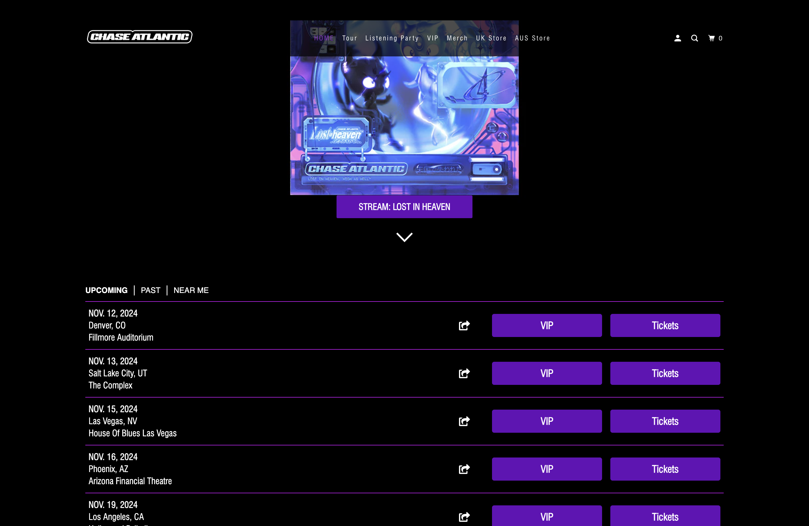
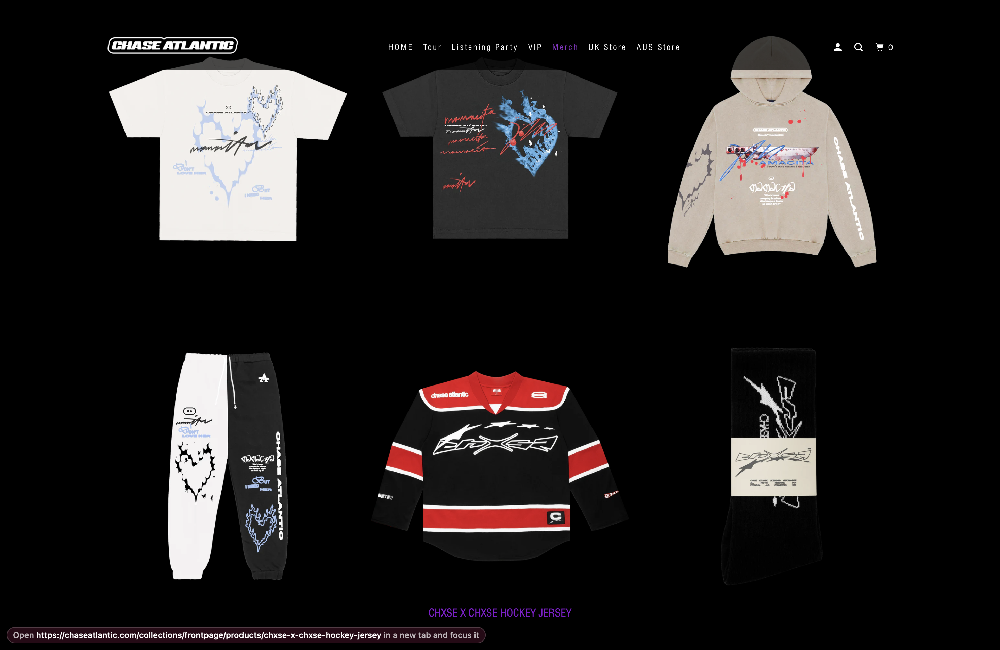
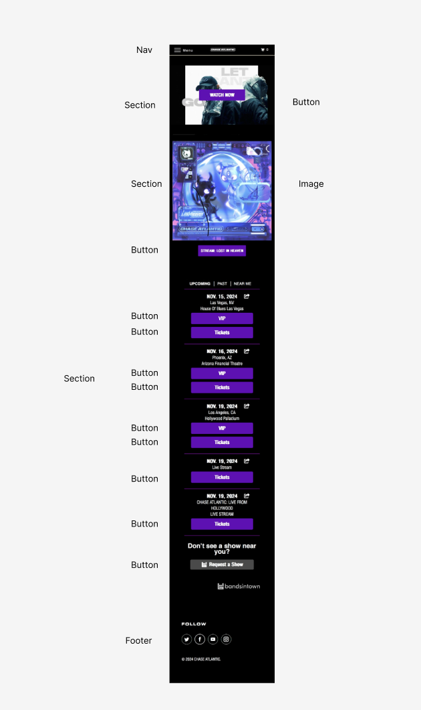

# Procesverslag
Markdown is een simpele manier om HTML te schrijven.  
Markdown cheat cheet: [Hulp bij het schrijven van Markdown](https://github.com/adam-p/markdown-here/wiki/Markdown-Cheatsheet).

Nb. De standaardstructuur en de spartaanse opmaak van de README.md zijn helemaal prima. Het gaat om de inhoud van je procesverslag. Besteedt de tijd voor pracht en praal aan je website.

Nb. Door *open* toe te voegen aan een *details* element kun je deze standaard open zetten. Fijn om dat steeds voor de relevante stuk(ken) te doen.

## Jij

  
uitwerken voor kick-off werkgroep

  ### Auteur:
  Nina Hoogenraad

  #### Je startniveau:
  Blauw 

  #### Je focus:
  Surface Plane
 

## Je website

  
uitwerken voor kick-off werkgroep

  ### Je opdracht:
  https://chaseatlantic.com/ 

  #### Screenshot(s) van de eerste pagina (small screen): 
  Homepage 
  

  #### Screenshot(s) van de tweede pagina (small screen):
  Merch 
  
 

## Toegankelijkheidstest 1/2 (week 1)

  
uitwerken na test in 2e werkgroep

  ### Bevindingen
  
  - Lijst met je bevindingen die in de test naar voren kwamen:

  - De website is niet helemaal toegankelijk 
  - Geen headings (op de merch en Homepage)

## Breakdownschets (week 1)

  
uitwerken na afloop 3e werkgroep

  ### de hele pagina: 
  

  ### dynamisch deel (bijv menu): 
  

  ### wellicht nog een dynamisch deel (bijv filter): 
  

## Voortgang 1 (week 2)

  
uitwerken voor 1e voortgang

  ### Stand van zaken
  
- Ik focus vooral mijn aandacht op de oefeningen
- Kan ik mijn site mooeir maken maar is dat de bedoeling?

  ### Agenda voor meeting

FEMMA: 
- Wat doe je als je site Nederlands en Engels is? (Heb ik ook als probleem)
- Wanneer gebruik je grids en wanneer gebruik je flexbox?

ROMY:
- hoet zit het met divs? wanneer mag je wel of niet een div gebruiken?

NINA:
- site van chase atlantic is niet per se mooi? mag ik dat aanpassen op mijn website?

  ### Verslag van meeting
  hier na afloop snel de uitkomsten van de meeting vastleggen

  - goed kijken of het een button of link is (en dan in CSS stylen)
  - Formulier bij de merch
  - cijfer gaat niet over je vormgeving maar vooral op je vanilla HTML en CSS

## Voortgang 2 (week 3)

  
uitwerken voor 2e voortgang

  ### Stand van zaken
  - de lijst van alle concerten gin goed: vond het niet lastig om de a in form van button te maken en ze 
  op een rijtje zetten

  

  - omdat de website van chase atlantic niet werkt heb ik gekozen om een andere merch pagina na te maken: Teezily die
  ook Chase Atlantic merch verkoopt. Ik vind het wel erg challenging omdat er meerdere animaties en er zit ook een verticale
  scroll. 

  

  - Ten slotte vind ik het ook lastig om de navigatie bar te maken (met winkelmand en hamburgermenu), ik moet me nu dus verdiepen
  in Javascript zodat ik de hamburger menu zo kan maken.

  

  ### Agenda voor meeting
  samen met je groepje opstellen

  NINA:
- Nav bar maken? 
- Hoe je de css van de 2de pagina  moet maken zonder een nieuwe css      
- Hoe zet ik een knop op de youtube filmpje waar ik op kan klikken  

SUSAN: 
- Vragen over svg en li

FEMMA: 
- kan ze nog switchen naar reponsive? 
- mogen a's naar niks leiden (gewoon hoe het eruit ziet en niet werkend)?
- Hoe zet je fotos bij de prodcutpagina?

ROMY: 
- Vragen over de productpagina

  ### Verslag van meeting
  hier na afloop snel de uitkomsten van de meeting vastleggen
GESPREK MET STUDENTASSISTENT

- Moeilijk om een button in plaats van de button van youtube te maken (ga he uiteindelijk toch niet doen)
- Uiteindelijk 2 css gemaakt omdat mijn vormgeving ech verschillend is op mijn pagina's

## Toegankelijkheidstest 2/2 (week 4)

  
uitwerken na test in 9e werkgroep

  ### Bevindingen
  Lijst met je bevindingen die in de test naar voren kwamen (geef ook aan wat er verbeterd is):

  - Dat alles goed wordt gelzen: ook alt van de t-shirts
  - h1 en h2 aanpassen omdat het verwart uitziet en dat de gebruiker het onduidelijk zou vinden met gebruik van een reader

## Voortgang 3 (week 4)

  
uitwerken voor 3e voortgang

  ### Stand van zaken
 - De fixed bestelling plaatsen button gaat over mijn nav waardoor ik het ook zie wanneer mijn hamburger menu open is 
 - fout op Chrome over aria label=hidden

 - Heel goed onderweg, nog een paar aanpassigen en dan ben ik klaar (header en hamburger menu fixen en de animaties moeten er nog in)

  ### Agenda voor meeting
  samen met je groepje opstellen

  ROMY:

  - Little Petshop website is niet heel mooi kan ik dat aanpassen (ja want docent gaat niet de 2 websites met elkaar vergelijken)
  - gebruik van divs voor de merch pagina van de Petshops

  SUSAN: 
  
  - site aangepast en gen divs meer. Page met formulier er groot in is goed maar moet wat extra bij 

  FEMMA:

  - Of er een alt of aria-label bij een foto moet zijn die eigenlijk een a is 

  NINA:
  - De fixed bestelling plaatsen button gaat over mijn nav waardoor ik het ook zie wanneer mijn hamburger menu open is 
 - fout op Chrome over aria label=hidden

  ### Verslag van meeting
  hier na afloop snel de uitkomsten van de meeting vastleggen

  - Gebruik z-index om de layer van de nav bar over de button te zetten
  - Kijken naar aria label hidden want dat staat zo voor mijn hamburergermenu maar het moet juist zichtbaar zijn en de cross juist hidden want die zie je pas wanneer je op de hamburgermenu klikt

## Eindgesprek (week 5)

  
uitwerken voor eindgesprek

  ### Je uitkomst - karakteristiek screenshots:
  

  ### Dit ging goed/Heb ik geleerd: 
  Korte omschrijving met plaatjes

  

  ### Dit was lastig/Is niet gelukt:
  Korte omschrijving met plaatjes

  

## Bronnenlijst

  
continu bijhouden terwijl je werkt

  Nb. Wees specifiek ('css-tricks' als bron is bijv. niet specifiek genoeg). 
  Nb. ChatGpT en andere AI horen er ook bij.
  Nb. Vermeld de bronnen ook in je code.

  1. Chat Gpt: voor de input van maat en aantal stuks (met als prompt: kan je een input maken voor een maat en aantal stuks selectie)

  2. Social Media Icons by NiftyButtons https://niftybuttons.com (in de footer van Merch en Home html)

  3. Code Pen /Dlo: hulp met formulier maken (die docent had gestuurd als )

